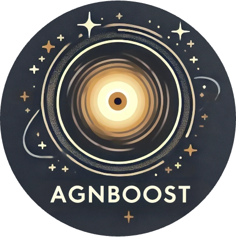

<div align="center">
  <table>
    <tr>
      <td align="left">
        <h1>AGNBoost: A machine learning toolkit for astronomical data analysis using XGBoost</h1>
      </td>
      <td align="center" width="220">
        
      </td>
    </tr>
  </table>
  
  [](https://hamblin-ku.github.io/AGNBoost/)
  [](https://www.python.org/downloads/)
  [](https://opensource.org/licenses/MIT)
</div>

---

AGNBoost is a machine learning framework focused on efficiently identfying populations of candidates Active Galactic Nuclei (AGN) from photometric data. AGNBoost is built on [XGBoostLSS](https://statmixedml.github.io/XGBoostLSS/), an extension of the well known XGBoost algorithm to distributional modeling. The framework comes with pre-trained models for AGN identification and photometric redshift estimation from JWST NIRCam+MIRI photometric data, trained on catalogs of mock galaxies from [CIGALE](https://cigale.lam.fr/).


## `Features`
<ul>
  <li> Complete distirbutional modeling with XGBoostlss </li> 
  <li> Robust estimates of both model uncertainty and uncertainty and uncertainty due to photometric error</li> 
  <li> Flexible framework that allows: </li> 
  <ul>
    <li> Simple model creation and re-training </li> 
    <li> Straightforward incorporation of additional photometric bands and target variables </li> 
  </ul>
  <li> Missing photometric data imputation with SGAIN </li> 
</ul>

## `Installation`

### Prerequisites
- Python 3.10 or later

### Quick Install
To directly install the latest development version with pip, please use:
```bash
pip install git+https://github.com/hamblin-ku/AGNBoost.git
```

### Using Virtual Conda Environment (Recommended)

```bash
# Create and activate a conda environment
conda create -n agnboost python=3.11
conda activate agnboost

pip install git+https://github.com/hamblin-ku/AGNBoost.git
```

## `Documentation`

Complete documentation is available on GitHub Pages:

**🌐 [https://hamblin-ku.github.io/AGNBoost/](https://hamblin-ku.github.io/AGNBoost/)**

The documentation includes:

- **[Tutorials](https://hamblin-ku.github.io/AGNBoost/tutorials/basic-usage/)**: Example jupyter notebooks illustrating how to use AGNBoost. The covered topics include:
<ul>
<li>A basic usage tutorial</li>
<li>Creating custom features and transforming target variables</li>
<li>Using AGNBoost with custom photometric bands</li>
<li>Training and Tuning AGNBoost models from scratch</li>
</ul>

- **[API Reference](https://hamblin-ku.github.io/AGNBoost/api/)**: Complete documentation of all classes and methods

## `Contributing`

We welcome contributions! Please see our [Contributing Guide](https://kurthamblin.github.io/agnboost/contributing/) for details on how to get involved.

## `License`

This project is licensed under the MIT License - see the [LICENSE](LICENSE) file for details.

## `Acknowledgments`

- Built on [XGBoostLSS](https://statmixedml.github.io/XGBoostLSS/) for distributional modeling
- Uses [SGAIN](https://github.com/dtneves/ICCS_2021) for photometric imputation
- [CIGALE](https://cigale.lam.fr/) used for mock galaxy catalog creation

---

<div align="center">
  <strong>If you use AGNBoost in your research, please see our <a href="https://kurthamblin.github.io/agnboost/citation/">citation guide</a>.</strong>
</div>


